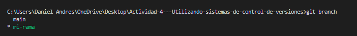
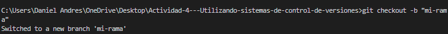
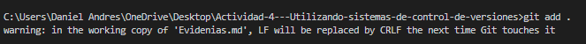
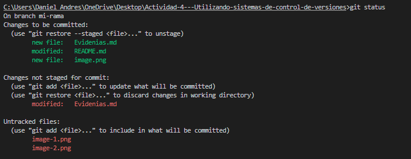
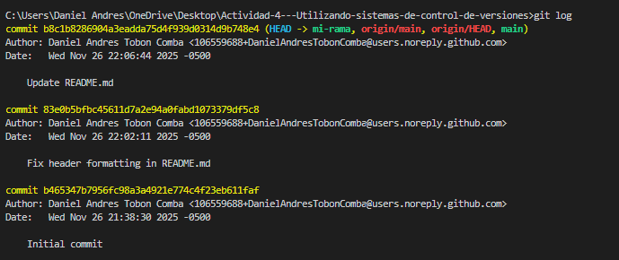
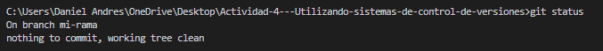
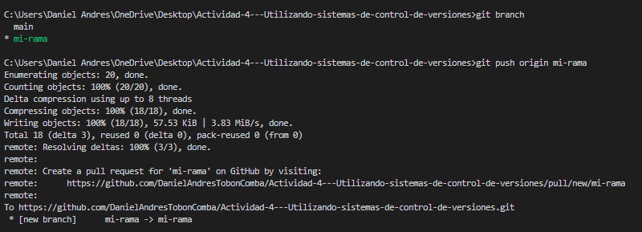

## Git clone

## Git branch - Git checkout
Proceso a crear y cambiar de rama para el manejo de ramas y version sin tocar la main/master

## Git add .
Agrego los cambios localmente

## Git status
Reviso el estado del git para saber si todos los archivos han sido guardados

## Git log
Reviso el historial de logs

## Git status 
Veo otra vez el estado de mi arbol y esta limpio 

## Git push
Realizo de push de mi rama a mi rama ara crear un pull request sobre ""mi-rama" y no la main/master
